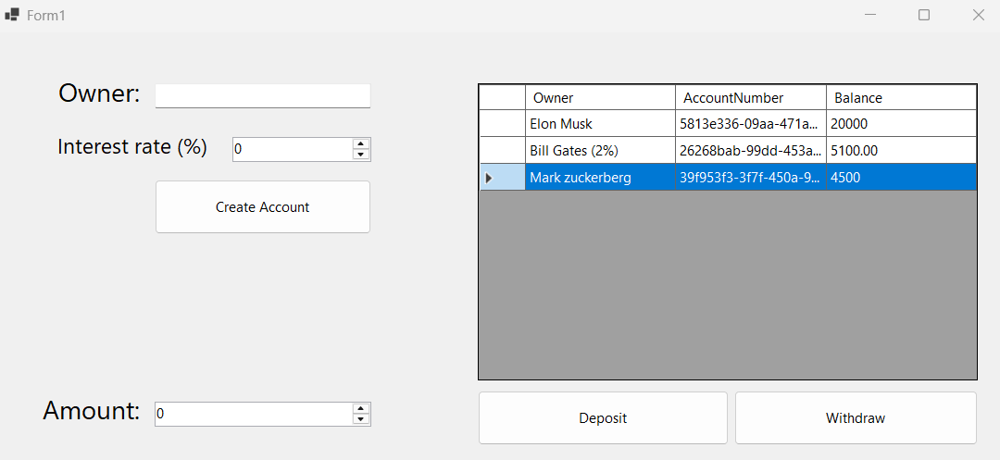

# bankAccountsApp

**bankAccountsApp** is a Windows Forms application built with C# that simulates a basic banking system. Users can create bank accounts, deposit or withdraw money, and manage both standard and savings accounts. The app visually displays all accounts in a table and showcases core principles of object-oriented programming (OOP).



## 💡 Features

- Create new bank accounts with a unique account number
- Support for:
  - **Normal accounts** (0% interest rate)
  - **Savings accounts** (non-zero interest rate)
- Deposit and withdraw money
- Display all accounts in a table with:
  - Owner name
  - Account number
  - Balance
- Real-time UI updates on transactions

## 🧱 Technologies Used

- **C#**
- **.NET Framework / Windows Forms**
- Object-Oriented Programming (OOP):  
  - **Encapsulation**
  - **Inheritance**
  - **Polymorphism**
  - **Abstraction**

## 🚀 Getting Started

1. Clone the repository:
   ```bash
   git clone https://github.com/yourusername/bankAccountsApp.git
